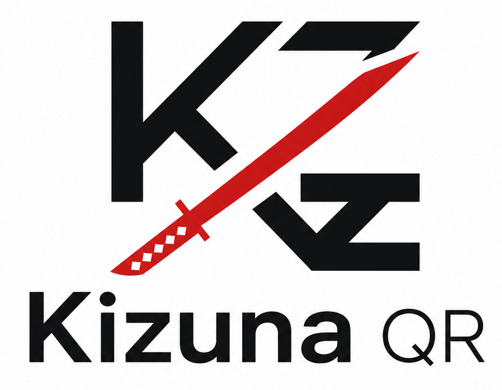

<div align="center">
  
  <h1>KizunaQR ⛩️</h1>
  <p>A gorgeous, professional, and open-source QR Code Engine inspired by the aesthetic of Demon Slayer.</p>

  <p>
    <a href="https://github.com/chiragchanchal/KizunaQR"></a>
    <a href="https://github.com/chiragchanchal/KizunaQR/blob/main/LICENSE"></a>
    <a href="https://fastapi.tiangolo.com"></a>
    <a href="https://vercel.com/"></a>
  </p>
</div>

---

## ⚡ Real Matrix Engine
Unlike generic QR generators that use fake HTML overlays or CSS tricks, **KizunaQR renders every pixel from the actual raw QR data matrix**. 
This means what you see on the screen is exactly what gets downloaded as a pure PNG byte-stream. No mocked previews. 

With high Error Correction (Level H & Q) built into the rendering pipeline, your QR codes will scan flawlessly even when utilizing deep customizations, custom typography, or center emblems.

## ✨ Features

- 🎨 **Beautiful Glassmorphism UI:** A sleek, fully responsive, and professional frontend control panel.
- 🎇 **Interactive Particle Wordmark:** The header features an ultra-premium Canvas 2D interactive particle physics engine that forms the wordmark and scatters on hover.
- 🎴 **Demon Slayer Palettes:** Hand-curated, muted aesthetic presets including *Hinokami*, *Muzan*, *Urokodaki*, and *Keepsake* (no harsh neons).
- 🖼️ **Intelligent Framing:** Wrap your QR codes in stunning borders (Circular, Sticker, Finder, Floating Pill, or 'Scan Me' banner).
- ✍️ **Custom Typography:** Overlay text effortlessly with intelligent dynamic placements that adapt to the selected frame.
- 🛡️ **Vercel-Ready & Secure:** Built with FastAPI, memory decompression bomb protection, and pre-configured for instant Vercel Serverless deployment.

---

## 🚀 Quick Start (Local)

**1. Clone the repository:**
```bash
git clone https://github.com/chiragchanchal/KizunaQR.git
cd KizunaQR
```

**2. Install dependencies:**
```bash
pip install -r requirements.txt
```

**3. Run the development server:**
```bash
uvicorn app:app --reload
```
*Then open `http://127.0.0.1:8000` in your browser!*

---

## 🌐 API Reference

KizunaQR operates as a headless QR rendering engine that can be consumed by any client.

### `POST /generate`
Generate a stylized QR code PNG. 
- **Request Body (JSON):**
  - `content` (str) - The URL or text (Max 2048 chars).
  - `scheme` (str) - Preset name (e.g., `"hinokami"`).
  - `fg` / `bg` (str) - Custom hex colors.
  - `round` (bool) - Round the QR modules.
  - `frame` (str) - Frame style (e.g., `"scan_me"`, `"circular"`).
  - `text` (str) - Custom text overlay.
- **Response:**
  - `200 OK`: Returns Base64 encoded PNG bytes `{"data": "data:image/png;base64,..."}`
  - `400 Bad Request`: Validation or security error.

---

## 🤝 Contributing
This is an open-source project! If you want to add new frames, palettes, or improve the Canvas physics engine, feel free to open a Pull Request.

<div align="center">
  <i>"Rendered from the real matrix · nothing mocked"</i>
</div>
